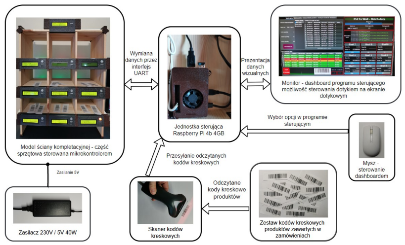
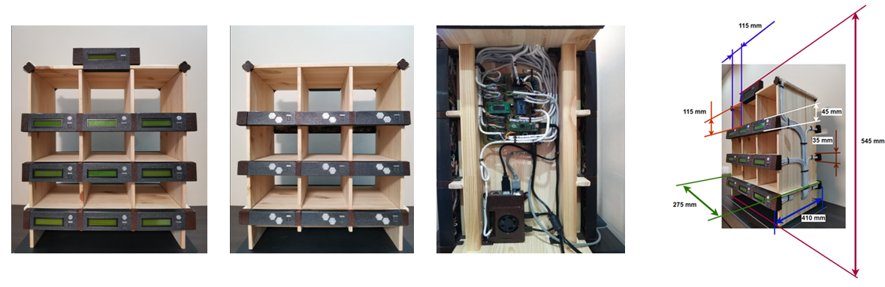
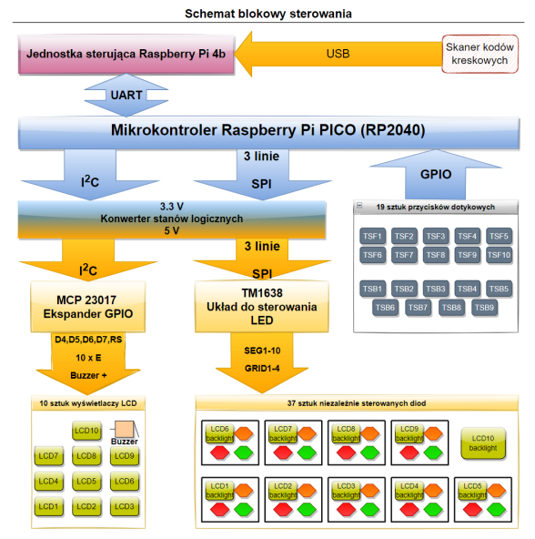
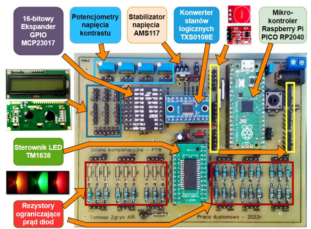

# Put to Wall - project
It is a fully functional system that implements the Put to Wall idea. 
It was created as a graduation project.
The system is designed to support the processing of multi-item orders, in terms of assigning products (collected from racks to common collective trolleys) to the corresponding orders.
It supports the operator's work by speeding up and simplifying the entire process. It eliminates the need to manually verify each product in the order database and minimizes the risk of errors during the logistics process.
Dedicated to e-commerce.

At the beginning, all electronic elements were selected and appropriate electrical diagrams were made. 
Then, an electrical diagram was made and a PCB design based on it, integrating all control components. 
All elements of the system were made in-house (including PCB). 
Plastic elements were designed in Autodesk Fusion 360 and printed on 3D printing.

### This is the hardware part of entire project which contains: 
1. #### Order picking wall

2. #### Control software for microcontroller Raspberry Pi PICO - written in Micropython
3. #### Additionally, Control application written in Pyside 2 - in this case designed for Raspberry Pi 4B 4GB (posted in a separate repository)

The order picking wall is controlled by the RPi PICO microcontroller.
The LEDs (information lamps) are controlled by the Titan Micro Electronics TM1638 integrated circuit.
The two-line, 16-character, alphanumeric LCD's are controlled by the Microchip MCP23017 16-bit GPIO expander.
The TTP223 touch sensors are used as confirmation buttons.

Below is a block diagram and PCB control board of the hardware part.

 

### Principle of operation - order picking wall (hardware part)

- Assigning a batch (list of orders) to the wall - by selecting from the list of ready batches
- The display at the top shows the batch number, the number of collective containers and the number of orders in a given batch
- Start scanning products
- Refilling compartments as indicated - blinking light in the target compartment
- Confirmation with the button after completion
- Displaying information on displays and by means of information lamps
- Completion of order picking is signaled by the appropriate color - a green light flashes on the rear wall
- After emptying, confirming with the button
- Color is changing to red
- Possibility to reallocating this compartment by another order
- Unregistering the batch from the wall
- Wall releasing and resetting
